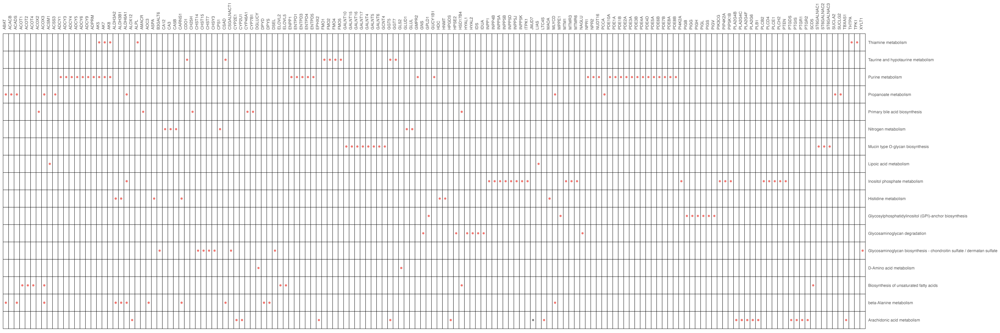

# Example-unique analyses

## Loading the data

The case study is an integrated metabolic and transcriptional analysis to understand the rapidly proliferating breast cancers (Liao, et al., 2022). In this paper, the authors characterized the metabolomic profile of two types of 31 breast tumors in human to uncovered pyrimidine metabolism and glutaminolysis pathways are elevated in TNBC. As an example of mixed metabolites and genes analyses, here we are going to use both the dataset of metabolite and gene expression data as reported in the paper. The metabolomics data was accessed from the Supplementary Tables S2 in the paper, and the gene expression data is from the author. They found that pyrimidine and purine metabolism, carbon metabolism, and the energy production related pathways were highly enriched in Cluster 2 while many lipid/fatty acid metabolism related pathways were enriched in Cluster 1.
We will use MNet to identify a set of features whose activity changes significantly between the two sample clusters.This result will hopefully hint at some specific biological activities that are pathologically altered in tumoral samples.

```{r,eval=FALSE}
library(dplyr)
library(MNet)
library(stringr)
library(ggplot2)
library(RColorBrewer)

#load("data/meta_dat.rda")
#load("data/gene_dat.rda")
#load("data/group.rda")
diff_meta <- mlimma(meta_dat,group)
diff_gene <- mlimma(gene_dat,group)
#head(diff_meta)
#head(diff_gene)
```

## Pathway enrichment analysis

### Extended pathway enrichment

KEGG metabolic pathway-based extended pathway enrichment (EPE) analysis to investigate the dysregulation of metabolic pathways considering both metabolites and genes using the function 'PathwayAnalysis'.

```{r,eval=FALSE}
## combine the metabolite information and gene information

all_dat <- rbind(diff_gene,diff_meta)

## filter the increase differential genes and metabolites
all_dat1 <- all_dat %>%
  dplyr::filter(logFC>0.58) %>%
  dplyr::filter(adj.P.Val < 0.05)

## the increase pathway analysis of both genes and metabolites
result1 <- PathwayAnalysis(all_dat1$name,out="Extended",p_cutoff=0.01)

ggsave("result_v0131/EPE1.png",result1$gp,width=30,height = 5)
ggsave("result_v0131/EPE_gene_meta_cluster1.png",result1$p_barplot,width=10,height = 10)

## filter the decrease differential genes and metabolites
all_dat2 <- all_dat %>%
  dplyr::filter(logFC < -0.58) %>%
  dplyr::filter(adj.P.Val < 0.05)

result2 <- PathwayAnalysis(all_dat2$name,out="Extended",p_cutoff=0.01)
ggsave("result_v0131/EPE2.png",result2$gp,width=30,height=5)
ggsave("result_v0131/EPE_gene_meta_cluster2.png",result2$p_barplot,width=10,height = 10)

p <- cowplot::plot_grid(plotlist = list(result1$p_barplot,result2$p_barplot))
ggsave("result_v0131/EPE_gene_meta.png",p,width=20,height = 10)
```


### metabolite pathway enrichment
KEGG metabolic pathway-based pathway enrichment (PE) analysis to investigate the dysregulation of metabolic pathways considering metabolites.
```{r,eval=FALSE}
all_dat <- diff_meta

all_dat1 <- all_dat %>%
  dplyr::filter(logFC>0.58) %>%
  dplyr::filter(adj.P.Val < 0.05)

result1 <- PathwayAnalysis(all_dat1$name,out="metabolite",p_cutoff=0.1)

ggsave("result_v0131/PE_meta1.png",result1$gp,width=5,height = 10)
write.table(result1$output,"result_v0131/PE_meta1.txt",quote=F,row.names=F,sep="\t")
ggsave("result_v0131/PE_meta_cluster1.png",result1$p_barplot,width=10,height = 10)

all_dat2 <- all_dat %>%
  dplyr::filter(logFC < -0.58) %>%
  dplyr::filter(adj.P.Val < 0.05)

result2 <- PathwayAnalysis(all_dat2$name,out="metabolite",p_cutoff=0.1)
write.table(result2$output,"result_v0131/PE_gene2.txt",quote=F,row.names=F,sep="\t")

ggsave("result_v0131/PE_meta2.png",result2$gp,width=15,height = 5)
ggsave("result_v0131/PE_meta_cluster2.png",result2$p_barplot,width=10,height = 10)

p <- cowplot::plot_grid(plotlist = list(result1$p_barplot,result2$p_barplot))
ggsave("result_v0131/PE_meta.png",p,width=20,height = 10)
```


### gene pathway enrichment
KEGG metabolic pathway-based pathway enrichment (PE) analysis to investigate the dysregulation of metabolic pathways considering genes.
因为基因差异注释后的比较少，所以选择阈值小点的

```{r,eval=FALSE}
all_dat <- diff_gene

all_dat1 <- all_dat %>%
  dplyr::filter(logFC>0.58) %>%
  dplyr::filter(adj.P.Val < 0.05)

result1 <- PathwayAnalysis(all_dat1$name,out="gene",p_cutoff=0.1)

write.table(result1$output,"result_v0131/PE_gene1.txt",quote=F,row.names=F,sep="\t")

ggsave("result_v0131/PE_gene1.png",result1$gp,width=30,height = 10)
ggsave("result_v0131/PE_gene_cluster1.png",result1$p_barplot,width=10,height = 10)

all_dat2 <- all_dat %>%
  dplyr::filter(logFC < -0.58) %>%
  dplyr::filter(adj.P.Val < 0.05)

result2 <- PathwayAnalysis(all_dat2$name,out="gene",p_cutoff=0.1)
write.table(result2$output,"result_v0131/PE_gene2.txt",quote=F,row.names=F,sep="\t")

ggsave("result_v0131/PE_gene2.png",result2$gp,width=25,height = 5)
ggsave("result_v0131/PE_gene_cluster2.png",result2$p_barplot,width=10,height = 10)

p <- cowplot::plot_grid(plotlist = list(result1$p_barplot,result2$p_barplot))
ggsave("result_v0131/PE_gene.png",p,width=20,height = 10)
```





## Pathway differential abundance score

### Extended pathway differential abundance score
KEGG metabolic pathway-based extended differential abundance (EDA) analysis investigate the dysregulation of metabolic pathways considering both metabolites and genes.

```{r,eval=FALSE}

diff_gene_increase <-  diff_gene %>%
  dplyr::filter(logFC>0.58) %>%
  dplyr::filter(adj.P.Val < 0.05)
diff_gene_decrease <- diff_gene %>%
  dplyr::filter(logFC < -0.58) %>%
  dplyr::filter(adj.P.Val < 0.05)

diff_meta_increase <- diff_meta %>%
  dplyr::filter(logFC>0.58) %>%
  dplyr::filter(adj.P.Val < 0.05)

diff_meta_decrease <- diff_meta %>%
  dplyr::filter(logFC < -0.58) %>%
  dplyr::filter(adj.P.Val < 0.05)

 ExtendDAscore_result <- DAscore(c(diff_gene_increase$name,diff_meta_increase$name),c(diff_gene_decrease$name,diff_meta_decrease$name),c(diff_gene$name,diff_meta$name),min_measured_num = 2,out="Extended")

 ggsave("result_v0131/EDA.png",ExtendDAscore_result$p,width=10,height = 15)

```


### metabolite differential abundance score
KEGG metabolic pathway-based differential abundance (DA) analysis investigate the dysregulation of metabolic pathways considering only metabolites.
```{r,eval=FALSE}
diff_meta_increase <- diff_meta %>%
  dplyr::filter(logFC > 0.58) %>%
  dplyr::filter(adj.P.Val < 0.05)

diff_meta_decrease <- diff_meta %>%
  dplyr::filter(logFC < -0.58) %>%
  dplyr::filter(adj.P.Val < 0.05)
dascore_result_meta <- DAscore(diff_meta_increase$name,diff_meta_decrease$name,diff_meta$name,out="metabolite")
ggsave("result_v0131/DAscore_metabolite.png",dascore_result_meta$p,width=10,height = 15)

```


### gene differential abundance score
KEGG metabolic pathway-based differential abundance (DA) analysis investigate the dysregulation of metabolic pathways considering only genes.
```{r,eval=FALSE}
diff_gene_increase <- diff_gene %>%
  dplyr::filter(logFC > 0.58) %>%
  dplyr::filter(adj.P.Val < 0.05)

diff_gene_decrease <- diff_gene %>%
  dplyr::filter(logFC < -0.58) %>%
  dplyr::filter(adj.P.Val < 0.05)
dascore_result_gene <- DAscore(diff_gene_increase$name,diff_gene_decrease$name,diff_gene$name,out="gene")
ggsave("result_v0131/DAscore_gene.png",dascore_result_gene$p,width=10,height = 15)

```


## MSEA Metabolite Set Enrichment Analysis

the metabolite set enrichment analysis using function "MSEA"

```{r,eval=FALSE}
result <- MSEA(sim.cpd.data)
result$leadingEdge <- as.character(result$leadingEdge)
write.table(result,file="result_v0131/MSEA.txt",quote=F,row.names=F,sep="\t")
```

the msea plot of interested pathway 
```{r,eval=FALSE}
p <- pMSEA("Butanoate metabolism",sim.cpd.data)
ggsave("result_v0131/MSEA_Butanoate.png",p,width=5,height = 4)
```


## Subnetwork analysis of Metabolism and transcriptome data from TNBC:
the data need to have the column name "name", and have the "p_value","logFC" is alternative. If have the "logFC", the color in the figure is the logFC, otherwise, the color "blue" in figure means metabolites and the color "red" means the genes.
```{r,eval=FALSE}

names(diff_meta)[4]  <- "p_value"
diff_metabolite <- diff_meta %>%
  dplyr::filter(adj.P.Val < 0.01) %>%
  dplyr::filter(abs(logFC)>1)

names(diff_gene)[4] <- "p_value"
diff_gene1 <- diff_gene %>%
  dplyr::filter(adj.P.Val < 0.01) %>%
  dplyr::filter(abs(logFC)>1)

pdf("result_v0131/subnetwork_important.pdf")
a <- pdnet(diff_meta,diff_gene,nsize=100)
dev.off()

```

```{r,echo=FALSE,fig.align='center',out.width="600px"}
library(knitr)
knitr::include_graphics("result_v0131/subnetwork_important.pdf")
```

## Subnetwork analysis of interested metabolites and genes
the data need to have the column name "name", and do not have the "p_value"
```{r,eval=FALSE}

pdf("result_v0131/subnetwork_interested.pdf")
## get 500 differential expression gene
a <- pdnet(diff_metabolite[,8],diff_gene1[1:500,8])
dev.off()
write.table(a,"result_v0131/subnetwork_interested_edge.txt",quote=F,row.names=F,sep="\t")
```

```{r,echo=FALSE,fig.align='center',out.width="600px"}
library(knitr)
knitr::include_graphics("result_v0131/subnetwork_interested.pdf")
```

