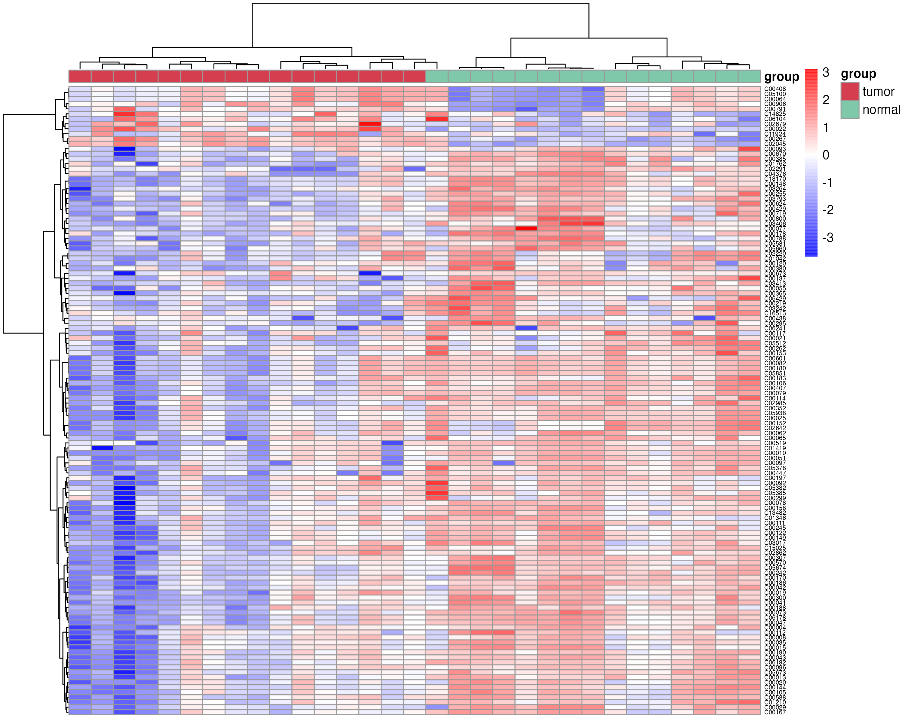
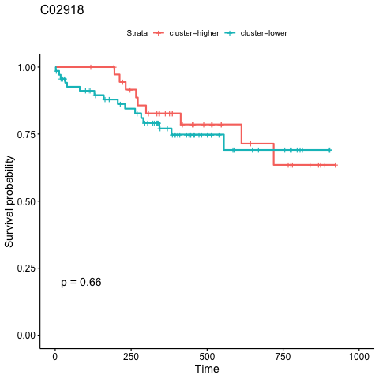

# Example-rountine analyses

## Metabolite and kegg name change

### Metabolite name changed to refmet name

This step requires networking  

RefMet: A Reference list of Metabolite names  
The main objective of RefMet is to provide a standardized reference nomenclature for both discrete metabolite structures and metabolite species identified by spectroscopic techniques in metabolomics experiments.

```{r,eval=FALSE}
compound_name <- c("2-Hydroxybutyric acid","1-Methyladenosine","tt","2-Aminooctanoic acid")
refmetid_result <- name2refmet(compound_name)
write.table(refmetid_result,"result_v0131/refmetid_result.txt",quote=F,sep="\t",row.names=F)
```

```{r,echo=FALSE,eval=TRUE}
library(dplyr)
refmetid_result <- data.table::fread("result_v0131/refmetid_result.txt") %>%
  as.data.frame()
refmetid_result
```

### Metabolite name changed to kegg id

This step requires networking  

search the kegg id corresponding to the metabolites name

```{r,eval=FALSE}
compound_name <- c("2-Hydroxybutyric acid","1-Methyladenosine","tt","2-Aminooctanoic acid")
keggid_result <- name2keggid(compound_name) %>%
  tidyr::separate_rows(kegg_id,sep=";") %>%
  tibble::as_tibble()

write.table(keggid_result,"result_v0131/keggid_result.txt",quote=F,sep="\t",row.names=F)
```

```{r,echo=FALSE,eval=TRUE}
library(dplyr)
keggid_result <- data.table::fread("result_v0131/keggid_result.txt") %>%
  as.data.frame()
keggid_result
```

### Metabolite name corresponding to kegg pathway

This step requires networking  

search the kegg pathway corresponding to the metabolite name

```{r,eval=FALSE}
compound_name <- c("2-Hydroxybutyric acid","1-Methyladenosine","tt","2-Aminooctanoic acid")
result_all <- name2pathway(compound_name)

##### the output is the each metabolite related pathway
result_name2pathway <- result_all$name2pathway
write.table(result_name2pathway,"result_v0131/name2pathway_keggpathway.txt",quote=F,sep="\t",row.names=F)
result_name2keggid <- result_all$kegg_id
write.table(result_name2keggid,"result_v0131/name2pathway_keggid.txt",quote=F,sep="\t",row.names=F)
result_name2enrichpathway <- result_all$pathway
write.table(result_name2enrichpathway,"result_v0131/name2pathway_pathwayenrich.txt",quote=F,sep="\t",row.names=F)
```

```{r,echo=FALSE, eval=TRUE}
df <- data.table::fread("result_v0131/name2pathway_keggpathway.txt") %>%
  as.data.frame()
df
```

```{r,echo=FALSE, eval=TRUE}
df <- data.table::fread("result_v0131/name2pathway_keggid.txt") %>%
  as.data.frame()
df
```
```{r,echo=FALSE, eval=TRUE}
df <- data.table::fread("result_v0131/name2pathway_pathwayenrich.txt") %>%
  as.data.frame()
df
```

### Metabolite keggid to kegg pathway
```{r,eval=TRUE}
library(MNet)
keggid <- c("C05984","C02494")
##### the output is the each metabolite related pathway
keggpathway_result <- keggid2pathway(keggid)
head(keggpathway_result)
```

### the pathway information
```{r,eval=TRUE}
result <- pathwayinfo("hsa00630")
result <- pathwayinfo("Glyoxylate and dicarboxylate metabolism")
result$gene_info[1:2,]
result$compound_info[1:2,]
```

### pathway name to pathway id
```{r,eval=TRUE}
pathwayid <- pathway2pathwayid("Glycolysis / Gluconeogenesis")
pathwayid
```

## Group-wise analyses
### PCA plot

PCA of the data

```{r,eval=FALSE}
### the pca plot
p_PCA <- pPCA(meta_dat,group)
ggplot2::ggsave("result_v0131/1.PCA_1.png",p_PCA$p1)
ggplot2::ggsave("result_v0131/1.PCA_2.png",p_PCA$p2)
ggplot2::ggsave("result_v0131/1.PCA_3.png",p_PCA$p3)
```

{width=50%} 
{width=50%}
{width=50%}


### Differnetial metabolite analysis

#### using the function mlimma in R packages "MNet"
```{r,eval=FALSE}
diff_result <- mlimma(meta_dat,group)

```

#### using the function DM in R packages "MNet"

```{r,eval=FALSE}

diff_result <- DM(2**meta_dat,group)
dev.off()
write.table(diff_result,"result_v0131/DM_result.txt",quote=F,row.names=F,sep="\t")

## filter the differential metabolites by default fold change >1.5 or < 1/1.5 ,fdr < 0.05 and VIP>1

diff_result_filter <- diff_result %>%
  dplyr::filter(fold_change >1.3 | fold_change < 1/1.3) %>%
  dplyr::filter(fdr_wilcox<0.1) %>%
  dplyr::filter(vip>0.8)

utils::write.table(diff_result,"result_v0131/2.all_TumorvsNormal.txt",quote=F,row.names=F,sep="\t")
utils::write.table(diff_result_filter,"result_v0131/2.diff_TumorvsNormal.txt",quote=F,row.names=F,sep="\t")

```

```{r,echo=FALSE,eval=FALSE}
library(dplyr)
out_dir="result"
df <- data.table::fread(paste0("result","/2.diff_TumorvsNormal.txt")) %>%
  as.data.frame()
df %>% DT::datatable(options=list(pageLength=5,searchHighlight=T,buttons=c('csv','copy'), dom='Bt',scrollX=T,fixedColumns=list(leftColumns=1)), style='default', caption="", rownames=FALSE, escape=F, extensions=c('Buttons','FixedColumns'))
```


### Differential metabolites' volcano

the volcano plot of metabolites using the function "pVolcano" in the package "MNet"

```{r,eval=FALSE}
p_volcano <- pVolcano(diff_result,foldchange=1.5)
#p_volcano
#ggplot2::ggsave("result_v0131/3.volcano.pdf",p_volcano)
ggplot2::ggsave("result_v0131/3.volcano.png",p_volcano)

```
{width=50%}

### Differential metabolites' heatmap

the heatmap plot of differentital metabolites using the function "pHeatmap" in R package "MNet"

```{r,eval=FALSE}
meta_dat_diff <- meta_dat[rownames(meta_dat) %in% diff_result_filter$name,]
p_heatmap <- pHeatmap(meta_dat_diff,group,fontsize_row=5,fontsize_col=4,clustering_method="ward.D",clustering_distance_cols="correlation")
ggplot2::ggsave("result_v0131/3.heatmap.png",p_heatmap,width=10,height=8)

```
{width=50%}

### Differential metabolites' zscore

the zscore plot of differentital metabolites using the function "pZscore" in R package "MNet"

```{r,eval=FALSE}
p_zscore <- pZscore(meta_dat_diff,group)
#p_zscore
ggplot2::ggsave("result_v0131/3.z_score.png",p_zscore,width=3,height=8)

```
{width=50%}


## Feature selection

### Boruta 
```{r,eval=FALSE}
#group <- rep("normal",length(names(meta_dat)))
#group[grep("TUMOR",names(meta_dat))] <- "tumor"
meta_dat1 <- t(meta_dat) %>%
  as.data.frame() %>%
  dplyr::mutate(group=group)

result_ML_Boruta <- ML_Boruta(meta_dat1)
```

### Random Forest
```{r,eval=FALSE}
result_ML_RF <- ML_RF(meta_dat1)
result_ML_RF$p
result_ML_RF$feature_result
```

### XGBoost
```{r,eval=FALSE}
result_ML_xgboost <- ML_xgboost(meta_dat1)
result_ML_xgboost$p
result_ML_xgboost$feature_result
```

### LASSO
```{r,eval=FALSE}
result_ML_lasso <- ML_alpha(meta_dat1,method="lasso")

```

### elastic network
```{r,eval=FALSE}
result_ML_elastic <- ML_alpha(meta_dat1,method="elastic")
```
## Pathway analysis

### pathview only metabolite

```{r,eval=FALSE}
kegg_id <- c("C02494","C03665","C01546","C05984","C14088","C00587")
value <- c(-0.3824620,0.1823628,-1.1681486,0.5164899,1.6449798,-0.7340652)
names(value) <- kegg_id
cpd.data <- value

gene_name <- c("LDHA","BCKDHB","PCCA","ACSS1")
gene_value <- c(1,0.5,-1,-1)
names(gene_value) <- gene_name

pPathview(cpd.data,outdir="result_v0131")
```


### pathview metabolite and gene

```{r,eval=FALSE}
pPathview(cpd.data=cpd.data,gene.data=gene_value,outdir="result_v0131")
```


## Clinical analysis
### Time series of clinical
the column contains the time, group, clinical index(such as ALT), low and high
```{r,eval=FALSE}
clinical_index[1:5,]
time_series_ALT <- pCliTS(clinical_index,"ALT")
ggsave("result_v0131/clinical_time_series.png",time_series_ALT)
```


### Survival analysis
```{r,eval=FALSE}
names(aml)[3] ="group"
p=survCli(aml)
png("result_v0131/survival.png")
p
dev.off()
```


### Metabolites’ survival plot

```{r,eval=FALSE}
metabolites <- c("C03819","C02918","C03916")
survMet(dat_surv,metabolites,cluster_method="mean",out_dir="result_v0131/survival/")
```


### Cox analysis

```{r,eval=FALSE}
result <- MetCox(dat_surv)
write.table(result,"result_v0131/clinical_cox.txt",quote=F,sep="\t",row.names = F)

```

# Session information

```{r,eval=TRUE}
sessionInfo()
```
